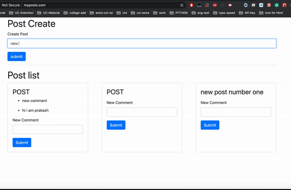
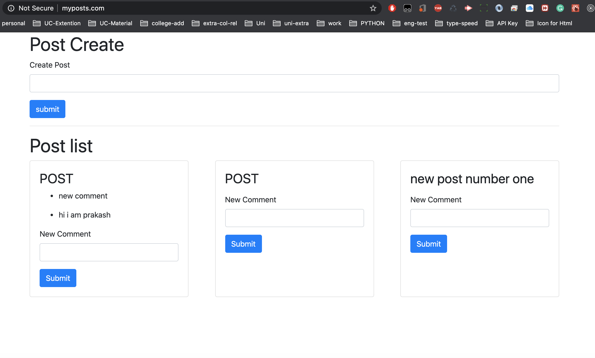

<h1>post-comment-microservice-node-react-application</h1>

This application intended to be the part of microservice architecture using <code>nodejs</code><code>Reactjs</code>. 

<h2>Development</h2>

Before you can build this project, you must install and configure the following:

<ul>
<li><a href="https://nodejs.org/en/">Node.js</a>: Node to run a development web server and build the project. Install node either source or as a pre-packaged bundle.</li>
<li><a href="https://create-react-app.dev/">React.js</a>: A javascript Library for building Interface.</li>
<li><a href="https://www.docker.com/">Docker</a>:Docker provides the ability to package and run an application in a loosely isolated environment called container which contain everything that is required to run one single program. It makes easier to deploy the microservice application.
    <li> create a docker hub account</li>
</li>
</ul>

<h3>Get Started</h3>

Clone the repository

<code>git clone git@github.com:pracharya2601/post-comment-microservice-node-react.git</code>

Once you clone the repository <code>cd post-comment-microservice-node-react </code> and you will see several different folder with different services. Get into all folder and <code>npm install</code> except infra folder which is for developement and services.

    Open each <code>.yaml</code> file inside the <strong>infra</strong> and change username from<code> sepc: - image: username/imagename
    </code> with you docker userid keep the imagename same.

<h4>Docker Image Build </h4>

Run following command to create an image on docker.

<li><code>docker build -t yourdockerusername/client</code></li>
<li><code>docker build -t yourdockerusername/comments</code></li>
<li><code>docker build -t yourdockerusername/event-bus</code></li>
<li><code>docker build -t yourdockerusername/moderation</code></li>
<li><code>docker build -t yourdockerusername/posts</code></li>
<li><code>docker build -t yourdockerusername/query</code></li>

<a href="https://kubernetes.github.io/ingress-nginx/deploy/">Ingress</a> The Ingress is a Kubernetes resource that lets you configure an HTTP load balancer for applications running on Kubernetes, represented by one or more Services. Such a load balancer is necessary to deliver those applications to clients outside of the Kubernetes cluster.
<strong>Please follow documentation to create and ingress image on docker</strong>
 
<strong>create a Ingress image inside the event-bus folder</strong>

<h4>Development and services setup</h4>

Get into the K8s derectory

<li><code>kubectl apply -f .</code> set up developement and create service.</li>
<li><code>kubectl get pods</code> Check the application is runnning or not.</li>
<li><code>kubectl describe pod podname</code> See the detail if you got an error.</li>

 
<h4>Host file tweak</h4>

Go the the file

<li>For window <code>C:\Windows\System32\drivers\etc\hosts</code></li>
<li>For mac <code>/etc/hosts</code></li>

Add the following line and save it.

<code>127.0.0.1 myposts.com</code>

<h4>Run the app on browser<h4>

<code>myposts.com</code>

<h3>Screenshot</h3>

    

     

